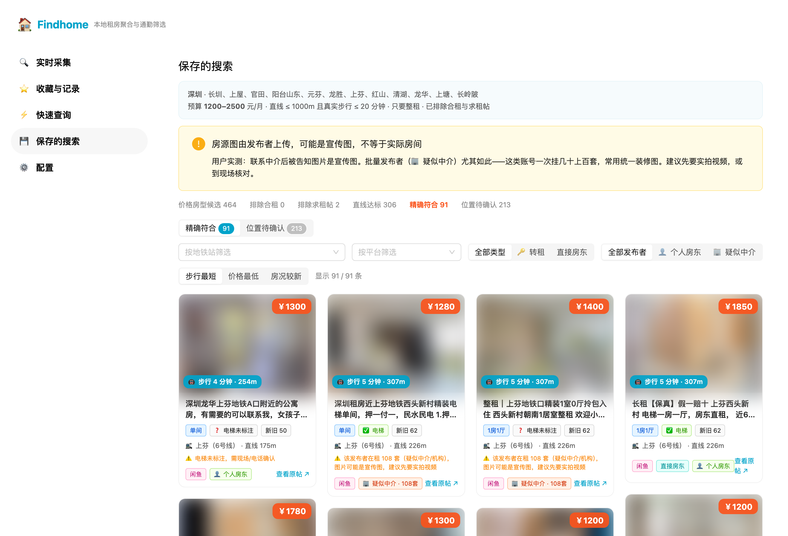
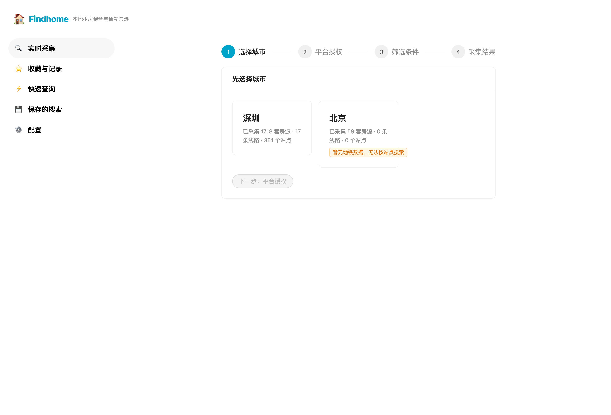
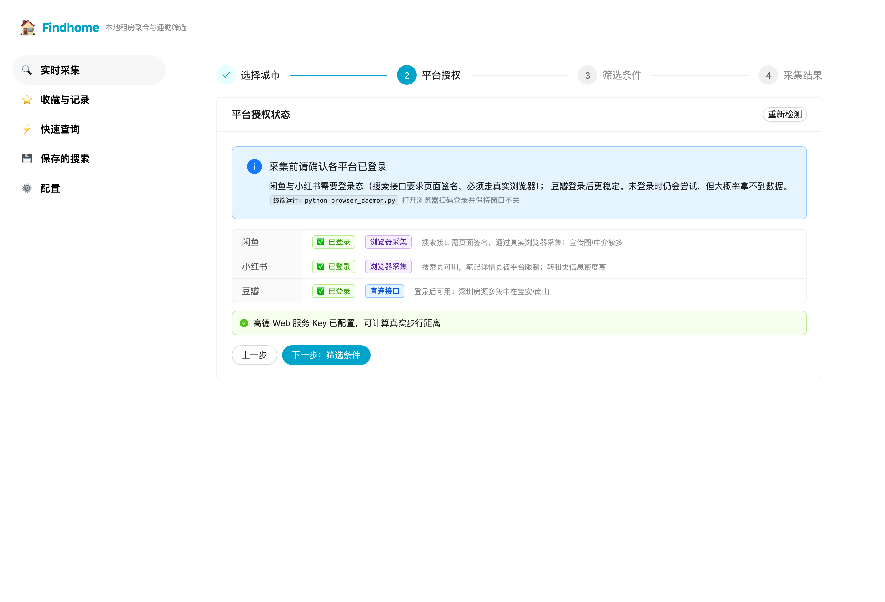
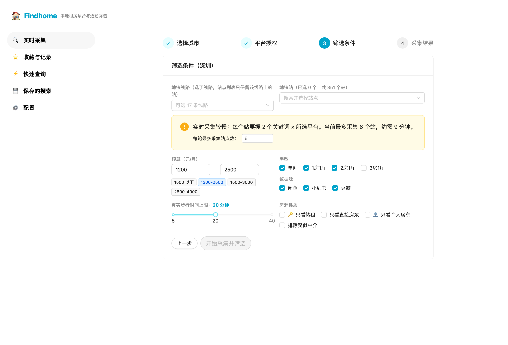
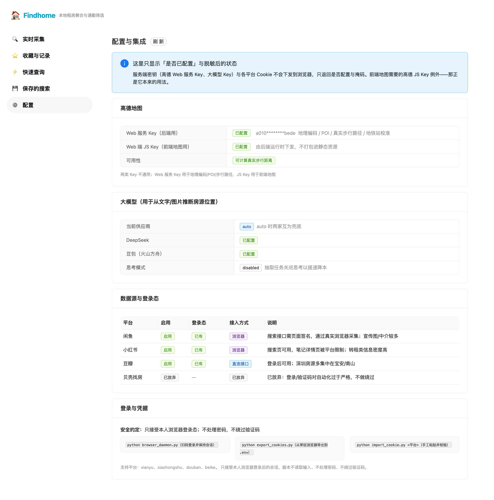

# Findhome

**按地铁站找房，而不是按行政区翻房。**

输入城市 + 地铁站 + 预算 + 房型 → 到闲鱼 / 小红书 / 豆瓣**按需采集**
→ 计算**真实步行距离** → 图文卡片呈现，并标出转租、疑似中介与可能为宣传图的房源。

> 全部数据只存在你自己电脑上。不绕过验证码、不逆向平台签名、不使用他人账号。

<br>

<h2 align="center">⭐ 本项目基于开源项目修改而成</h2>

<h1 align="center"><a href="https://github.com/liguobao/HouseSearch">liguobao / HouseSearch</a></h1>

<h3 align="center">感谢原作者与所有贡献者 🙏<br/>没有这个项目，就没有 Findhome</h3>

<br>

---

## 作者的话

这个项目**是一次学习，也是一次 AI 协作尝试**——不是商业产品，不打算收费，也不承诺维护。

我做它的起因很朴素：我有很具体的找房要求（在这几个地铁站附近、步行不超过 20 分钟、
只要整租、别太旧），但现成工具要么条件写死、要么得付费。于是我拿一个喜欢的开源项目改，
把它改成能服务自己的样子。

过程中真正让我意外的不是代码，而是**想法的落地速度**——从「我想要个能按地铁站筛房的工具」
到「它真的在跑，而且能开源给别人用」，中间隔的时间比我想象的短得多。

所以如果你也在犹豫「这个想法值不值得动手」，我的答案是：**值得，先做出来再说。**
这个仓库就当是一个样例，证明普通人借助 AI 也能把想法落地。

也正因如此：**这个项目是学习用途**。采集请控制频率、遵守平台规则，
不要拿去做批量倒卖或商业分发。原项目的许可（LGPL v3）继续沿用。

## AI 协作说明

这个项目由人和 AI 共同完成，分工如下：

| 环节 | 承担者 |
|---|---|
| 任务规划、需求拆解、**使用界限声明**、验收标准 | **WorkBuddy AI**、**ChatGPT** |
| 代码实现、测试编写、问题排查、提交与推送 | **DeepSeek Harness** |

过程中 AI 也犯过错，都记录在提交历史里（比如把"无电梯"误判成有电梯、
把懒加载占位图当成房源图、测试期望值算错等），这些修正过程本身就是这个仓库的一部分。

## 适合谁用

- **掌握 AI 开发工具的人**（Codex、Claude Code、DeepSeek Harness 等）——
  这个项目可以直接作为「改造一个开源项目」的参考样例
- **传统程序员**——技术栈常规（FastAPI + React + SQLite），没有黑魔法
- **有明确通勤要求、想自己掌控筛选逻辑的找房者**

> 如果你只是想「打开就能用」而不打算改代码，这个项目也能用，
> 但它的设计前提是**你会改它**。

## 项目目的

1. **搜索筛选租房资源** —— 按通勤条件反查，把「地铁站 + 步行时间 + 预算 + 房型」变成一次搜索
2. **AI 项目学习** —— 记录一个想法如何借 AI 从零落地，包括踩过的坑

## 主要功能

| 功能 | 说明 |
|---|---|
| 🚇 **按地铁站找房** | 选线路自动展开站点；支持同时选多个站 |
| 🚶 **真实步行距离** | 高德步行路径规划，不是直线折算 |
| 🔑 **转租识别** | 区分转租 / 直接房东 / 普通；转租贴的图与价通常更真实 |
| 🏢 **疑似中介标注** | 从图片地址提取发布者；一号挂几十上百套的标出来 |
| 🖼 **图片可信度提示** | 明说「图由发布者上传，可能是宣传图」，不假装能验真 |
| ⭐ **收藏与备注** | 收藏 / 已联系 / 不感兴趣 / 备注，独立于采集数据保存 |
| 📍 **位置精度分级** | 只写「某站附近」的单列一栏，**不拿站点坐标冒充 0 米** |
| ⏱ **按需采集** | 你点「开始」才去采，采完即停（不是 24 小时爬虫） |

## 界面截图

**采集结果**：图文卡片，含价格、步行时间、房型、电梯状态、发布者身份



<details>
<summary><b>🖼 查看其余界面截图（点开）</b></summary>

<br>

**① 选择城市** —— 支持的城市与已采集房源数



**② 平台授权** —— 各平台登录态检查，未登录会明确提示



**③ 筛选条件** —— 按线路选站、预算、房型、步行时间、房源性质



**④ 收藏与记录**（`/favorites`）—— 独立保存，采集覆盖房源时不丢


**⑤ 配置与集成**（`/settings`）—— 密钥只显示掩码，服务端密钥不下发浏览器



</details>

> 截图中房源图片已打码，文字保持可读；不含浏览器边框，不携带本机信息。

---

<details>
<summary><b>📖 使用教程（点开）</b></summary>

<br>

### 环境要求

Python 3.11+、Node.js 18+、（可选）Chromium 用于浏览器采集。

### 1. 部署

```bash
git clone https://github.com/Xuzc317/Findhome.git
cd Findhome

# 后端
python -m venv .venv
source .venv/bin/activate          # Windows: .venv\Scripts\activate
pip install -r requirements.txt

# 前端
cd frontend && npm install && npm run build && cd ..

# 配置
cp .env.example .env               # 至少填高德 Web 服务 Key
```

### 2. 启动

```bash
# 必须在项目根目录执行（后端用 backend.xxx 绝对导入）
uvicorn backend.main:app --host 0.0.0.0 --port 8000
```

打开 <http://localhost:8000>

### 3. 配置密钥

`.env` **不要提交到 Git**。

| 变量 | 用途 | 必需 |
|---|---|---|
| `AMAP_WEB_KEY` | 高德「**Web服务**」Key：地理编码 / POI / 步行路径 | ✅ 强烈建议 |
| `AMAP_KEY` + `AMAP_SECURITY_CODE` | 高德「**Web端(JS API)**」Key：前端地图 | 可选 |
| `DEEPSEEK_API_KEY` / `DOUBAO_API_KEY` | 大模型，从文字/图片推断位置 | 可选 |
| `DOUBAN_COOKIE` 等 | 平台登录态 | 见下 |

> ⚠️ 高德两类 Key **不通用**。JS Key 填到 `AMAP_WEB_KEY` 会报
> `10009 请求 Key 与绑定平台不符`。申请：<https://console.amap.com/dev/key/app>
>
> 没配 `AMAP_WEB_KEY` 也能用，但只能按直线距离筛选。

### 4. 平台登录

闲鱼、小红书需要登录态。工具提供扫码助手，**不索取密码、不处理验证码**：

```bash
python browser_daemon.py      # 打开浏览器，扫码登录后保持窗口不关
python export_cookies.py      # 导出登录态到 .env（只显示掩码）
python import_cookie.py --check   # 校验是否仍有效
```

也可以手工导入：`python import_cookie.py douban`

### 5. 首次采集

```bash
python crawl.py metro --city 深圳                          # 导入地铁数据
python collect_from_browser.py xianyu --profile longhua \
       --suffix 转租 --suffix 直租                          # 浏览器采集
python crawl.py douban --city 深圳                          # 豆瓣
python crawl.py locate --city 深圳                          # 定位
python crawl.py match  --profile longhua                    # 匹配
```

也可以全部在网页上点完。

### 6. 加入你自己的条件

**方式一：界面上填**（推荐）—— 选城市 → 检查登录 → 填条件 → 开始采集

**方式二：保存为常用搜索** —— 界面点「保存为常用搜索」，存进 `data/profiles/<名字>.json`

**方式三：直接改档案文件**

```jsonc
// data/profiles/longhua.json
{
  "name": "longhua",
  "city": "深圳",
  "stations": ["上芬", "上塘", "元芬", "红山", "龙胜", "龙华"],
  "max_straight_m": 1000,        // 直线距离上限（米）
  "max_walk_minutes": 20,        // 真实步行上限（分钟）
  "price_min": 1200,
  "price_max": 2500,
  "layouts": ["studio", "1b1l", "2b1l"],   // 单间 / 1房1厅 / 2房1厅
  "rent_types": [3, 4],          // 3整租 4公寓；空=不限
  "exclude_shared": true,        // 排除合租
  "avoid_old_small": true,       // 排除老破小
  "listing_kinds": ["sublet"],   // 只看转租：sublet / direct / normal
  "poster_types": ["individual"],// 只看个人房东
  "sort_by": "walk"              // walk / price / newness
}
```

**方式四：调 API**

```bash
curl -X POST http://localhost:8000/api/search \
  -H "Content-Type: application/json" \
  -d '{"city":"深圳","line_names":["6号线"],"price_min":1200,"price_max":2500,
       "layouts":["studio","1b1l"],"listing_kinds":["sublet"],"max_walk_minutes":20}'
```

接口文档：<http://localhost:8000/docs>

### 7. 自检

```bash
python tests/test_parsers.py      # 71 项（离线）
python tests/test_dedup_risk.py   # 16 项
python tests/test_metro_geo.py    # 41 项（离线）
python tests/test_match.py        # 25 项（内存库隔离）
python verify_api.py              # 46 项（需后端运行）
python verify_search.py           # 52 项（含密钥不泄漏断言）
python check_secrets.py           # 密钥 / Cookie 不进 Git
```

### 常见问题

<details>
<summary><b>提示 ModuleNotFoundError: No module named 'backend'</b></summary>

必须在**项目根目录**运行 `uvicorn backend.main:app`，
不能 `cd backend && uvicorn main:app`（后端用 `backend.xxx` 绝对导入）。
</details>

<details>
<summary><b>采集不到数据 / 提示需要登录</b></summary>

1. 确认常驻浏览器还开着（`python browser_daemon.py`）
2. `python import_cookie.py --check` 看登录态是否过期
3. 平台风控触发时需要等冷却，**不要加大频率**

**贝壳已放弃**：它对自动化的校验过严（带 Cookie 的 HTTP 直连仍被判未登录，
真实浏览器打开也回到登录页），在不绕过访问控制的前提下无法稳定采集。
</details>

<details>
<summary><b>距离显示「位置待确认」是什么意思</b></summary>

有些房源只写「某地铁站附近」，没有小区名。这时**不能用站点坐标当房源坐标**
（那会把距离算成 0 米，是假的），所以单独列出来，距离需要你自己点开原帖确认。
</details>

<details>
<summary><b>图片看着都很漂亮，是真的吗</b></summary>

**无法保证。** 房源图由发布者上传，可能是宣传图。已实测：联系的"中介"告知图片是宣传图。
工具能做的是标注发布者身份（👤 个人房东 / 🏢 疑似中介），
**判断真伪需要你自己要实拍视频或现场核对**。
</details>

</details>

---

<details>
<summary><b>🏗 技术路线与代码结构（点开）</b></summary>

<br>

### 架构

```
┌─────────────────────────────────────────────────────────────┐
│  前端  React 18 + TypeScript + Vite 5 + Ant Design 5        │
│  ├─ /            实时采集向导（城市→授权→条件→结果）          │
│  ├─ /favorites   收藏与记录（用户数据）                       │
│  ├─ /search      快速查询（查本地已采数据，秒出）              │
│  ├─ /saved       保存的搜索                                   │
│  └─ /settings    配置与集成状态                               │
└───────────────────────────┬─────────────────────────────────┘
                            │ REST  /api/*
┌───────────────────────────▼─────────────────────────────────┐
│  后端  FastAPI + SQLAlchemy 2 + SQLite                       │
│                                                              │
│  routers/    search  tasks  marks  metro  geo  houses …      │
│  services/   match        匹配引擎（预筛→步行→条件→排序）      │
│              collect_task 任务化采集（不阻塞 HTTP 请求）       │
│              amap         高德客户端（3 QPS 节流 + 缓存）      │
│              geolocate    位置推断（小区/地址/站点 → 坐标）    │
│              condition    转租 / 中介 / 电梯 / 新旧 识别       │
│              integrations 统一配置与脱敏                      │
│  crawlers/   base         Adapter 基类 + 状态机               │
│              manager      入库 / 去重 / 风险评分 / 事务        │
│              douban beike                    HTTP 直连        │
│              browser_fetch xianyu xiaohongshu   真实浏览器    │
└───────────────────────────┬─────────────────────────────────┘
                            │
        ┌───────────────────┼───────────────────┐
        ▼                   ▼                   ▼
   高德 Web 服务        DeepSeek / 豆包       平台页面
   地理编码/POI/步行路径   文字与图片理解      （真实浏览器会话）
```

### 技术选型

| 层级 | 选型 | 说明 |
|---|---|---|
| 前端 | React 18 + TS + Vite 5 + Ant Design 5 | 五个自有页面，无账号体系 |
| 后端 | FastAPI + SQLAlchemy 2 | `backend.xxx` 绝对导入 |
| 数据库 | SQLite | 单文件零配置；`houses` 与 `house_marks` 分离 |
| 采集 | httpx + BeautifulSoup / Playwright | Adapter 模式，各平台独立 |
| 地理 | 高德 Web 服务 + 静态地铁数据 | 坐标统一 GCJ-02 |
| 大模型 | DeepSeek / 豆包 | `LLM_PROVIDER=auto` 互为兜底 |

### 四条关键设计取舍

**① 采集分两类**
豆瓣、贝壳走 HTTP 直连；闲鱼、小红书的搜索接口要求页面 JS 生成的签名参数。
**不做签名逆向**，改用真实浏览器打开搜索页、只读渲染结果——跟手工浏览没有区别。

**② 长任务不阻塞请求**
一次采集是分钟级的，所以做成任务（`POST /tasks/collect` → 轮询进度）。
任务跑在同一事件循环内，同步阻塞的定位与距离计算丢进线程池，
否则连进度接口都会卡住。

**③ 用户数据与采集数据分表**
`houses` 是平台数据的镜像，每次采集会覆盖；
`house_marks` 是你的收藏与备注，独立存放，不随采集或房源下架丢失。

**④ 不伪造数据**
只写「某站附近」的房源不拿站点坐标冒充房源坐标；
电梯状态区分「原文明确写了」与「按楼层推断」；拿不到价格就留空，不猜。

### 目录结构

```
Findhome/
├── backend/
│   ├── main.py            FastAPI 入口
│   ├── config.py          配置（路径以项目根为基准）
│   ├── models.py          SQLAlchemy 模型（含 house_marks）
│   ├── routers/           search / tasks / marks / metro / geo / houses …
│   ├── services/          match / collect_task / amap / geolocate /
│   │                      condition / integrations
│   └── crawlers/          base / manager / douban / beike /
│                          xianyu / xiaohongshu / browser_fetch
├── frontend/src/
│   ├── pages/             collect / favorites / search / saved / settings
│   ├── components/        header / menus / layout / house-card
│   └── services/          search / task / mark / metro / match
├── data/
│   ├── houses.db          SQLite（git 忽略）
│   ├── metro/             深圳地铁静态数据（17 线 351 站）
│   └── profiles/          需求档案 JSON
├── docs/                  数据源说明 / 验收记录 / Git 约定 / 截图
├── tests/                 离线测试
├── browser_daemon.py      常驻浏览器（保持登录态）
├── export_cookies.py      导出登录态到 .env
├── import_cookie.py       手工导入并校验 Cookie
├── collect_from_browser.py 浏览器采集 CLI
├── crawl.py               采集 CLI
├── login_browser.py       扫码登录助手
└── verify_*.py            接口自检
```

### 已知限制

1. **平台风控是主要不确定性**——触发后需等冷却；本项目不做验证码识别、签名逆向
2. **贝壳已放弃**——登录/验证码对自动化过严，不绕过就无法稳定采集
3. **小红书详情页被限制**——搜索页可用，笔记详情页不可访问，
   因此小红书房源多停在「位置待确认」
4. **图片无法验真**——只能标注发布者身份，真伪需你自己核实
5. **时间字段不猜**——平台不给发布时间的就留空，不拿采集时间冒充
6. **租金解析保守**——拿不到就显示未知，好过把手机号当租金
7. **SQLite 并发**——适合个人单机，不适合高并发写入

### 数据来源现状

| 平台 | 接入方式 | 状态 |
|---|---|---|
| 闲鱼 | 真实浏览器 | ✅ 可用（约 30 条/页） |
| 小红书 | 真实浏览器 | ✅ 搜索可用；详情页受限 |
| 豆瓣 | HTTP 直连 | ✅ 登录后可用 |
| 贝壳 | — | ❌ 已放弃（风控过严） |

### API 一览

| 方法 | 路径 | 说明 |
|---|---|---|
| POST | `/api/search` | 按任意条件搜索 |
| GET | `/api/search/cities` | 城市列表 + 在租数 |
| POST | `/api/tasks/collect` | 启动实时采集任务 |
| GET | `/api/tasks/{id}` | 任务进度（stage / progress / logs / result） |
| POST | `/api/marks` | 收藏 / 已联系 / 不感兴趣 / 备注 |
| GET | `/api/settings` | 统一配置状态（密钥脱敏） |
| GET | `/api/match` | 按保存的档案匹配 |
| GET | `/api/metro/lines\|stations\|stats` | 地铁数据 |
| GET | `/api/geo/stats` | 定位覆盖率 |

完整文档：<http://localhost:8000/docs>

</details>

---

## 许可

**LGPL v3**，与原项目保持一致。详见 [LICENSE](LICENSE)。

采集请遵守各平台服务条款与 robots 规则；本项目仅供个人学习与自查使用。
