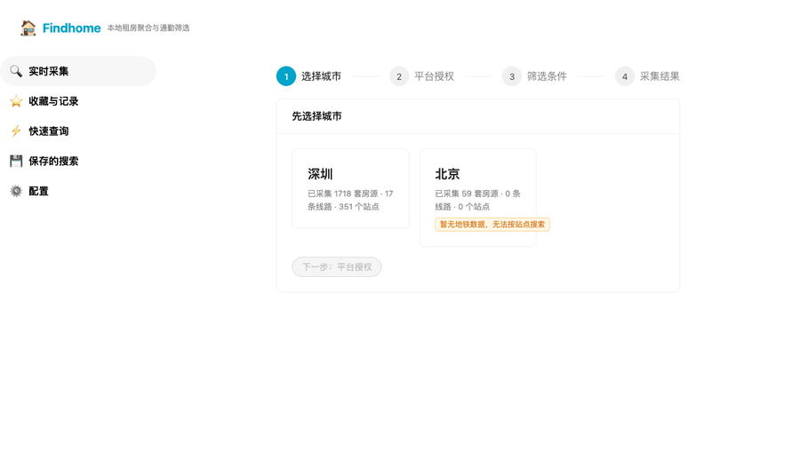
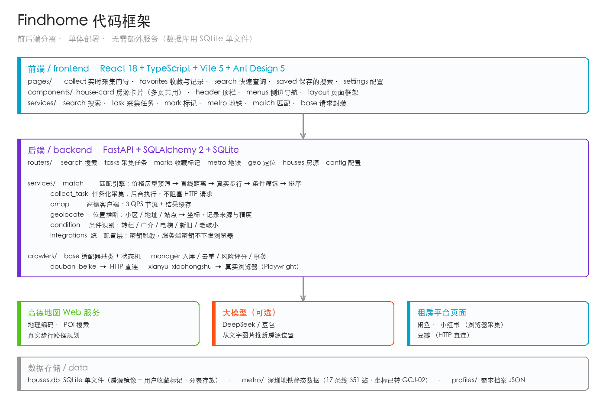

# 分享一个由ai百分百完成的开源项目

项目地址（复制到浏览器打开）：

**https://github.com/Xuzc317/Findhome/**

---

这是一个**从需求拆解、写代码、到测试，全部由 AI 完成**的租房工具。

它解决的问题很具体：所有租房平台都只能按「行政区」筛房，但我想要的是**按地铁站筛**——在几个站附近、步行不超过 20 分钟、预算多少、要什么房型。

选好地铁站和条件后，它会去闲鱼、小红书、豆瓣采集房源，再用高德地图算每条房源到地铁站的**真实步行时间**（不是直线距离），最后用图文卡片呈现出来。

还能自动识别转租、标注疑似中介、收藏并写备注。技术栈是 React + FastAPI + SQLite，本地运行，数据不上传。

**完全免费开源，欢迎去 GitHub 点个 Star ⭐**

---

---

> 边界声明：不绕过验证码、登录或访问控制，不逆向平台签名算法，
> 只使用本人浏览器的登录态。仅供个人学习与自查使用。
